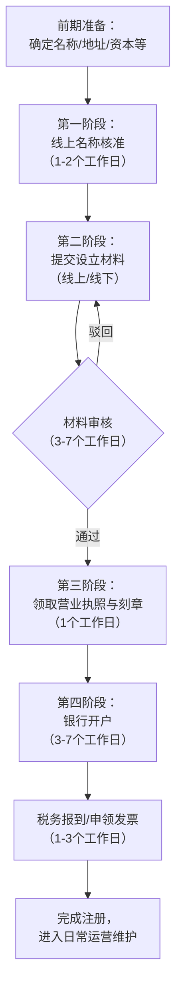

好的，这是一份使用完整 Markdown 语法编写的、详细的个人公司（通常指一人有限责任公司）注册流程指南。

# 个人有限公司注册全流程指南

## 📌 概述
本指南详细阐述在中国大陆设立**一人有限责任公司**的完整步骤、所需材料及注意事项。流程基于现行普遍规定，具体细节可能因地区政策略有差异。

---

## 📑 第一阶段：前期准备与核名

### 1.1 确定公司基本信息
| 事项 | 说明与要求 |
| :--- | :--- |
| **公司名称** | 格式：`行政区划 + 字号 + 行业表述 + 组织形式`   例：`深圳市 | 创想 | 科技 | 有限公司`   *准备3-5个备用名称，按喜好排序* |
| **注册资本** | 认缴制，需确定一个合理的数额。虽无需立即实缴，但影响股东责任大小。 |
| **经营范围** | 首项需与行业相关，描述需规范。可参考同行业公司或使用市监局的规范表述。 |
| **注册地址** | 需提供真实的商用地址证明（房产证复印件、租赁合同、租赁凭证）。住宅地址注册限制较多。 |
| **法定代表人** | 由股东（即本人）担任或另指定。 |
| **监事** | 一人有限公司需另设一名监事职位，可由亲友担任，不可由同一人兼任法人和监事。 |
| **财务人员** | 需提供财务负责人信息（姓名、身份证号、联系电话）。 |

### 1.2 在线提交名称预先核准
1. 登录 **“所在省市政务服务网”** 或 **“市场监督管理局网上办事平台”**。
2. 找到“企业开办”或“名称自主申报”入口。
3. 按照指引填写准备好的公司名称信息，进行查重和提交。
4. 审核通过后，下载打印《企业名称预先核准通知书》或获取核准编号。

---

## 📄 第二阶段：材料准备与提交

### 2.1 核心注册材料清单
1.  **《公司登记（备案）申请书》**（系统生成，在线填写后打印签字）。
2.  **《指定代表或者共同委托代理人授权委托书》**（如本人办理则无需）。
3.  **全体股东（即您本人）身份证复印件**。
4.  **监事身份证复印件**。
5.  **财务负责人身份证复印件**。
6.  **法定代表人任职文件**（股东决定）。
7.  **《企业名称预先核准通知书》**。
8.  **注册地址证明文件**：
    *   房产证复印件（产权人每页签字或盖章）。
    *   租赁合同原件及复印件。
    *   如为转租，需产权人同意转租的证明。
9.  **公司章程**（可在线生成模板，根据实际情况修改，由股东签署）。

### 2.2 提交方式
*   **线上全流程**：在政务服务网“企业开办一窗通”平台，上传所有人员身份证原件照片及地址证明扫描件，进行电子签名。
*   **线下窗口提交**：将上述所有材料的签字/盖章原件，提交至公司注册地所在区的**市场监督管理局**办事大厅。

---

## ⚙️ 第三阶段：领取执照与刻章

### 3.1 领取营业执照
*   材料审核通过后，根据通知，携带身份证原件及《准予设立登记通知书》，到市场监管局窗口领取**营业执照正、副本**。
*   支持邮寄送达。

### 3.2 刻制公司印章
*   凭营业执照和法定代表人身份证，到公安局备案的刻章点刻制。
*   **必备四章**：
    1.  `公司公章`
    2.  `财务专用章`
    3.  `法定代表人名章`
    4.  `发票专用章`
*   建议同时刻制`合同专用章`。
*   费用约几百元，部分地区对新开办企业有免费刻章政策。

---

## 🏦 第四阶段：银行开户与税务报到

### 4.1 开设公司基本存款账户
1.  预约一家商业银行的对公业务。
2.  携带以下材料前往办理：
    *   营业执照正副本原件
    *   公司章程原件
    *   公章、财务章、法人章
    *   法定代表人身份证原件（如经办人非法人，还需带经办人身份证及授权书）
    *   经营地址租赁合同等证明
3.  银行审核后，领取**开户许可证**或基本存款账户信息单。

### 4.2 税务报到与核定税种
1.  领取营业执照后**30日内**，到注册地所属的**税务局**办理报到。
2.  需提供营业执照副本、公章、银行开户信息、法人身份证等。
3.  税务人员核定公司税种（如增值税、企业所得税、个人所得税等）及纳税周期（月/季）。
4.  签订《三方扣税协议》（银行、公司、税务局），便于后续网上缴税。

### 4.3 申领税控设备与发票
1.  如需开票，需申请税控盘或UKey（目前多为免费）。
2.  办理发票票种核定，申请领取所需发票（增值税普通发票、专用发票等）。

---

## 📋 第五阶段：后续必要事项

### 5.1 社保与公积金开户
*   凭营业执照在所在市社保、公积金官网开设单位账户，为员工（包括法人自己）缴纳社保和公积金。

### 5.2 记账报税
*   **至关重要！** 公司成立后，无论是否有收入、是否经营，都必须按月/季进行**记账**并**向税务局申报**。
*   可聘请专职会计或委托专业的**代理记账公司**（适合初创小微企业）。

### 5.3 工商年报
*   每年 **1月1日至6月30日** 期间，通过“国家企业信用信息公示系统”报送上一年度的**年度报告**。
*   逾期未报将被列入“经营异常名录”，影响公司信用。

---

## ⚠️ 重要注意事项（一人有限公司特别风险）

> **《公司法》第六十三条规定**：一人有限责任公司的股东不能证明公司财产独立于股东自己的财产的，应当对公司债务承担连带责任。

这意味着：
1.  **公私财产必须严格分离**：必须开设独立公司账户，公司收支均通过该账户，**切忌与股东个人账户混用**。
2.  **规范财务记账**：保留所有业务相关的票据、合同，进行规范会计核算。
3.  **每年编制审计报告**（虽法规未强制所有一人公司提交，但为自证财产独立，建议进行审计）。

---

## 📊 流程总结与时间预估

**总耗时预估**：材料齐全顺利的情况下，**约15-20个工作日**可完成全部主要流程。

---
**免责声明**：本指南仅供参考，不构成法律意见。注册政策可能变动，请务必以当地市场监管局、税务局等部门的最新官方规定为准。建议在操作前咨询专业人士或代理机构。